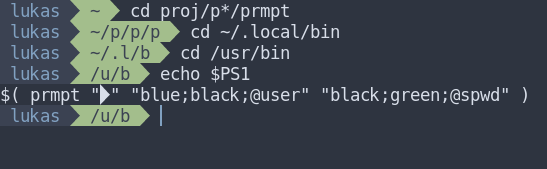

# prmpt

simple shell prompt engine in C

## preview



## templates

- @pwd
- @cwd
- @spwd
- @user
- @host

## usage

```bash
prmpt "separator" "fgcolor;bgcolor;text or @prepared-template" "same as thing after separator" "again" "..."
```

```bash
# my prompt:
prmpt "" "blue;black;@user" "black;green;@spwd"
```
